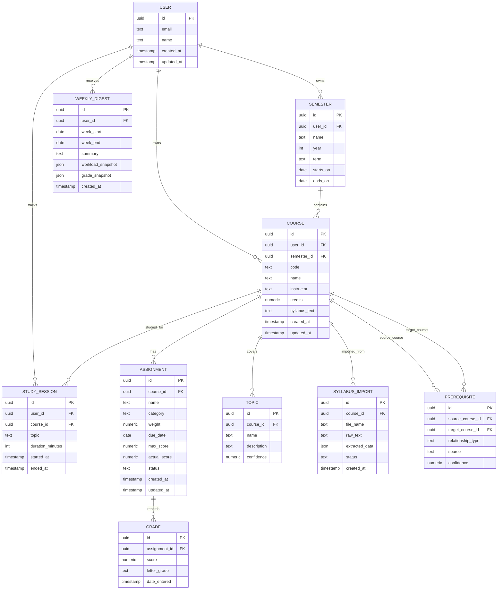

# Synapse Database Diagram

This diagram captures the first-pass relational model for Synapse as described in the project proposal. The core idea is that courses, assignments, grades, topics, and prerequisites form an academic graph that later AI features can query and summarize.

## Implementation Notes

- `course` is the central academic unit.
- `assignment` stores both deadlines and grading weights.
- `grade` preserves score history for trend analysis.
- `topic` and `prerequisite` form the academic graph.
- `syllabus_import` stores raw and structured extraction output for review and re-processing.
- `study_session` and `weekly_digest` support later workload forecasting and personalized summaries.
